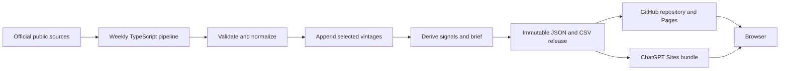
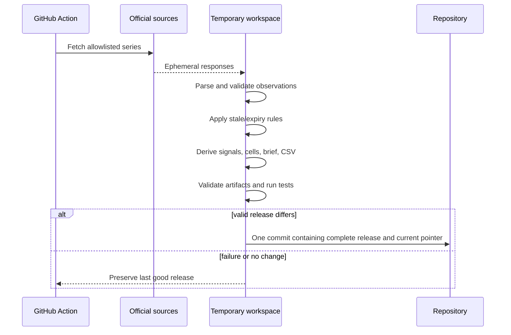

# Capflies architecture

Status: proposed for v1 implementation

Last updated: 2026-08-28

## 1. Purpose and constraints

Capflies is a public, read-only research instrument for seeing where global capital appears to be gathering, leaving, or accelerating over weeks and months. It is a trend radar, not a trading terminal, portfolio system, forecast engine, or replica of any commercial platform.

The architecture follows five constraints:

1. Official, freely accessible data only. No paid feeds, scraped finance sites, or restricted index data.
2. Stale data is acceptable when it is dated and labeled. Fabricated precision is not.
3. The browser renders precomputed artifacts. It does not call upstream financial APIs or calculate signals.
4. No application backend, database, authentication, real-time transport, or runtime LLM.
5. Every public value is traceable to selected official observations and a versioned method.

## 2. System context



The deployable application is static HTML, CSS, JavaScript, SVG, JSON, and CSV. GitHub Pages is the portable deployment and weekly artifact origin. ChatGPT Sites is the primary presentation host after a private version has been reviewed. Sites project linkage, when created, is stored in `.openai/hosting.json`; no D1, R2, sign-in, or secret runtime values are required.

## 3. Product surfaces

| Route | Responsibility |
| --- | --- |
| `/` | Global rotation matrix, strongest confirmed movements, divergences, deterministic weekly brief, and context charts |
| `/liquidity` | Global and regional liquidity conditions and their contributing series |
| `/cross-border` | Ranked cross-border flow lanes and histories without implying unavailable bilateral precision |
| `/markets` | Region and asset-class comparisons, with theme detail only when an official source supports it |
| `/methodology` | Definitions, transforms, thresholds, sources, coverage, licenses, limitations, and downloads |

The overview matrix uses regions `global`, `us`, `europe`, `asia`, and `emerging`, and asset classes `liquidity`, `equities`, `rates`, `credit`, `real-assets`, and `crypto`.

Unsupported cells remain visible as `unavailable`. Crypto begins as global CFTC Bitcoin positioning pressure only; it is not labeled as measured capital flow.

## 4. Evidence model

Each input and signal has exactly one evidence class:

- `measured`: an official publisher's reported economic flow or stock.
- `constructed`: a transparent calculation from official observations, such as Federal Reserve assets minus the Treasury General Account and ON RRP.
- `positioning`: official futures positioning used as pressure, not as cash flow.
- `inferred`: an official market price or yield transformed into directional pressure.

Each matrix cell preserves two independent tracks:

- `flowTrend`: measured or constructed movement of capital or liquidity.
- `pressure`: positioning or inferred leading pressure.

The tracks are never averaged into one composite. A cell state is one of:

- `confirming-in`: both tracks are positive and directionally agree.
- `confirming-out`: both tracks are negative and directionally agree.
- `diverging`: both exist and disagree.
- `flow-only`: only flow trend is defensible.
- `pressure-only`: only pressure is defensible.
- `insufficient`: configured evidence exists but fails history, coverage, or freshness rules.
- `unavailable`: no v1 source is configured.

## 5. Canonical contracts

Dates are ISO 8601. IDs are stable lowercase slugs. Schemas are versioned and validated at file boundaries.

```ts
type EvidenceKind = "measured" | "constructed" | "positioning" | "inferred";
type Frequency = "daily" | "weekly" | "monthly" | "quarterly";
type Freshness = "current" | "stale" | "expired";
type Confidence = "low" | "medium" | "high";
type RegionId = "global" | "us" | "europe" | "asia" | "emerging";
type AssetClassId = "liquidity" | "equities" | "rates" | "credit" |
  "real-assets" | "crypto";
type TransformId = "signed-flow" | "stock-change-13w" |
  "position-change-4w" | "price-return-13w" | "yield-change-13w";

interface SourceDefinition {
  id: string;
  publisher: "fed" | "ny-fed" | "treasury-fiscal" | "treasury-tic" |
    "ecb" | "boj" | "imf" | "bis" | "cftc";
  dataset: string;
  series: string;
  officialUrl: string;
  attribution: string;
  termsUrl: string;
  frequency: Frequency;
  expectedLagDays: number;
  staleAfterDays: number;
  expireAfterDays: number;
  unit: string;
  transform: TransformId;
  economicDirection: 1 | -1;
  evidenceKind: EvidenceKind;
  region: RegionId;
  assetClass: AssetClassId;
  track: "flowTrend" | "pressure";
}

interface Observation {
  id: string;
  sourceId: string;
  periodEnd: string;
  releasedAt: string | null;
  retrievedAt: string;
  value: number;
  unit: string;
  vintage: string;
  sourceChecksum: string;
  reconstructed: boolean;
}

interface Signal {
  id: string;
  region: RegionId;
  assetClass: AssetClassId;
  track: "flowTrend" | "pressure";
  evidenceKind: EvidenceKind;
  impulse: number;
  impulseUnit: string;
  score: number;
  acceleration: "increasing" | "stable" | "decreasing";
  asOf: string;
  releasedAt: string | null;
  freshness: Freshness;
  confidence: Confidence;
  calibrationObservations: number;
  reconstructed: boolean;
  observationIds: string[];
}

interface SignalSummary {
  signalId: string;
  score: number;
  acceleration: "increasing" | "stable" | "decreasing";
  evidenceKinds: EvidenceKind[];
  asOf: string;
}

interface SourceHealth {
  sourceId: string;
  status: "current" | "stale" | "expired" | "failed";
  checkedAt: string;
  message: string | null;
}

interface MatrixCell {
  id: string;
  region: RegionId;
  assetClass: AssetClassId;
  state: "confirming-in" | "confirming-out" | "diverging" |
    "flow-only" | "pressure-only" | "insufficient" | "unavailable";
  flowTrend: SignalSummary | null;
  pressure: SignalSummary | null;
  confidence: Confidence | null;
  freshness: Freshness | null;
  asOf: string | null;
}

interface ReleaseManifest {
  schemaVersion: 1;
  methodologyVersion: string;
  release: string;
  generatedAt: string;
  dataThrough: string;
  liveSince: string | null;
  reconstructed: boolean;
  previousRelease: string | null;
  sourceHealth: SourceHealth[];
  artifacts: Array<{ path: string; sha256: string }>;
}

interface CurrentRelease {
  schemaVersion: 1;
  release: string;
  manifestPath: string;
  manifestSha256: string;
}
```

Source definitions, expected coverage, thresholds, and deterministic tie-break ordering live in one reviewed registry. They are code and versioned provenance, not editable runtime settings.

For a signal with multiple inputs, `asOf` is the oldest contributing period end and `releasedAt` is the newest known release date. A matrix cell uses the oldest `asOf` among the summaries it displays. This prevents one fresh input from making older evidence appear current. When a publisher supplies no release timestamp, `releasedAt` remains `null`; the live vintage uses `retrievedAt` as the conservative availability bound without presenting it as an official release date.

## 6. Source adapters

The v1 registry allowlists individual series from:

| Adapter | Official scope used by Capflies |
| --- | --- |
| Federal Reserve | H.4.1 balance sheet and reserve balances; H.10 FX conversion; H.15 selected Treasury yields |
| New York Fed | ON RRP operation results |
| Treasury Fiscal Data | Daily Treasury Statement operating cash balance |
| Treasury TIC | Monthly foreign purchases and holdings of Treasuries, equities, agency, corporate, and foreign securities |
| ECB | Balance-sheet/liquidity series and official euro-area government yield curves |
| Bank of Japan | Total assets and monetary base |
| IMF | Reserves, balance-of-payments portfolio equity/debt flows, aggregate country groups, and primary commodity prices |
| BIS | Global liquidity indicators and locational cross-border bank claims |
| CFTC | Traders in Financial Futures and disaggregated positioning for selected rates, equity, FX, commodity, emerging-market, and Bitcoin contracts |

No adapter crawls a publisher. It receives one `SourceDefinition`, obtains the official response, selects only the configured series, validates it, and emits canonical observations:

```ts
interface SourceAdapter {
  fetch(definition: SourceDefinition): Promise<Uint8Array>;
  parse(bytes: Uint8Array, definition: SourceDefinition): Observation[];
}
```

Downloaded bytes are ephemeral. The pipeline records their SHA-256 checksum but commits only selected observations. Redirects must remain on an allowlisted official host. Parsing rejects non-finite values, unexpected units, duplicate observation identities, future periods, and missing selectors.

## 7. Transform and scoring rules

Each series defines one economic transform:

- Published flow: its signed official value, optionally summed over the configured three-month horizon.
- Balance or liquidity stock: 13-week percentage change.
- Positioning: four-week change in `(long - short) / open interest`.
- Price: 13-week percentage return, always labeled `inferred`.
- Yield: negative 13-week yield change so falling yields map to positive duration pressure, always labeled `inferred`.

`economicDirection` is applied before normalization. For observation at `t`, the calibration set contains only transformed observations strictly earlier than `t`, within the preceding ten years. The score is:

```text
sign(adjusted impulse) × percentile_rank(abs(adjusted impulse)) × 100
```

The score measures signed historical extremity; `+80` and `-80` do not claim symmetric probabilities. A score requires at least five calendar years and 20 prior transformed observations.

Strength conventions are fixed and described as conventions, not statistical significance:

- absolute score below 40: ordinary.
- 40 through 80: moderate.
- above 80: strong.

Acceleration compares the current score to its previous release. A change of at least `+15` is `increasing`, at most `-15` is `decreasing`, and otherwise it is `stable`.

A track is suppressed when fewer than 50% of its configured eligible inputs are usable. No missing value is zero-filled or silently imputed. Cell aggregation is the median of eligible scores within the same track.

Confidence is categorical:

- `high`: at least two current inputs with the same sign and full configured coverage.
- `medium`: one current input, or multiple current inputs with partial coverage but no sign disagreement.
- `low`: allowed stale carry, thin calibration history, or sign disagreement within a track.

Freshness is determined by each series' registry dates, not a global clock rule. One missed expected release may be carried as `stale` with its original as-of date. Beyond `expireAfterDays`, it becomes unusable.

## 8. Vintage model

Historical bootstrap data uses the latest official vintage available during reconstruction and carries `reconstructed: true`. It must never be described as a contemporaneous backtest.

Beginning with the first public release:

1. Observation identity is `(sourceId, series, periodEnd, vintage)`.
2. A revision appends a new identity; it never overwrites an earlier vintage.
3. A weekly release selects only observations available by that release's cutoff.
4. Published weekly artifacts are immutable.
5. Later revisions affect later releases only.
6. The methodology page can compare a live observation with its newest reconstructed value, but no predictive performance claim is made.

## 9. Weekly release transaction

The scheduled workflow runs each Monday in UTC and supports manual dispatch.



Artifacts use immutable paths such as `data/v1/releases/2026-W35/`. `data/v1/current.json` points to the current manifest. Stable ordering, explicit rounding, UTC dates, fixed English templates, fixed tie-breaking, and a methodology version make output reproducible. Retrieval timestamps are provenance but are excluded from content comparison.

An individual source outage does not corrupt or automatically abort a release. The pipeline carries the last observation once when allowed, then publishes the affected track as insufficient while recording source health. The entire release fails before commit if parsing violates a contract, derivation throws, a checksum or schema is inconsistent, tests fail, or the static build cannot consume the candidate artifacts.

The browser fetches `current.json`, verifies the declared schema, then fetches immutable artifacts. If the network fails, it may render the bundled last-good snapshot only with a persistent offline/stale notice.

## 10. Deterministic brief

The pipeline selects, in fixed order:

1. strongest medium-or-high-confidence `confirming-in` cell;
2. strongest medium-or-high-confidence `confirming-out` cell;
3. largest medium-or-high-confidence `diverging` cell.

Fixed templates insert region, asset class, direction, score band, evidence classes, and as-of date. Ties resolve by the registry's region and asset order. Missing categories are omitted rather than replaced with filler text. Identical snapshot, methodology version, and registry produce byte-identical brief text across locales and time zones.

## 11. Frontend architecture

```text
AppShell
├── PrimaryNavigation
├── DataFreshnessBanner
├── RouteContent
│   ├── Overview
│   ├── Liquidity
│   ├── CrossBorder
│   ├── Markets
│   └── Methodology
└── DetailDrawer
```

React owns rendering and interaction. D3 is limited to scales, shapes, and layout calculations; it does not mutate the DOM. Local React state handles transient interaction. The selected matrix cell is stored in the URL query string so links, reload, back, and forward work without a state dependency.

The design uses a near-black canvas, off-white text, teal for positive movement, coral for negative movement, and amber for warnings or stale data. Archivo and IBM Plex Mono are self-hosted under their open licenses. CSS custom properties are the single token source.

The matrix is the dominant desktop element. Every cell uses labels and geometry in addition to color. On narrow screens it becomes a deterministically ranked list. The detail drawer becomes a full-screen sheet and supports focus trapping, Escape dismissal, trigger-focus restoration, and URL addressing.

Every visualization has a semantic heading, plain-language summary, and accessible table or download equivalent. The application targets WCAG 2.2 AA contrast, visible focus, reduced motion, skip navigation, and no hover-only information.

## 12. Failure and trust boundaries

- Loading preserves layout and announces prolonged waits.
- Stale data remains visible with an amber notice and exact as-of date.
- Offline fallback never masquerades as current data.
- Unsupported schema versions stop the affected view with a useful message.
- Production validation rejects fixtures, fabricated values, missing provenance, non-official source hosts, future observations, and artifact checksum mismatches.
- Source terms and attribution are stored with the series registry and rendered on the methodology page.
- The site collects no personal or financial data and performs no financial transactions.
- Sites versions remain owner-only during review. Every Sites deployment is treated as production and requires explicit approval.

## 13. Deliberate exclusions

V1 has no accounts, portfolios, alerts, individual securities, recommendations, forecasts, live trading, real-time feeds, paid data, custom analytics SDK, runtime AI, database, API server, WebMCP tools, custom domain, or SEC N-PORT ingestion. These are not extension points in the initial code; they can be designed later if a demonstrated need appears.
